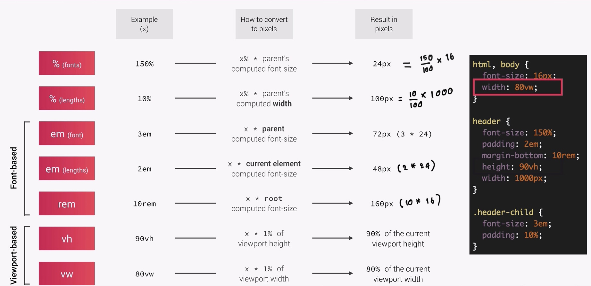
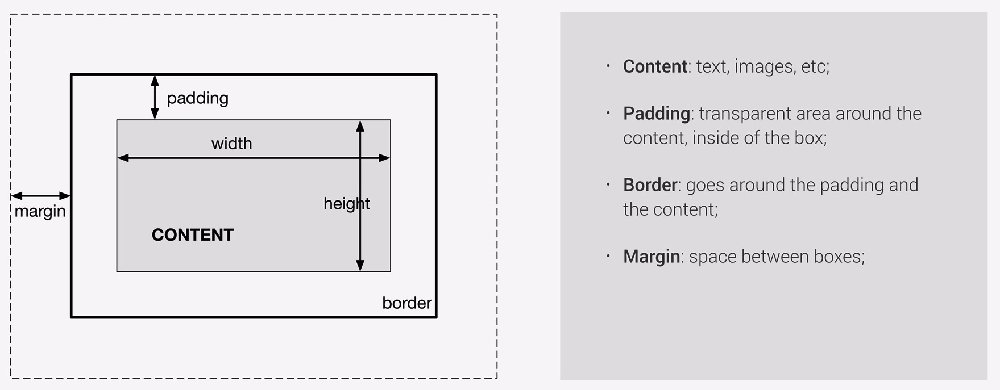
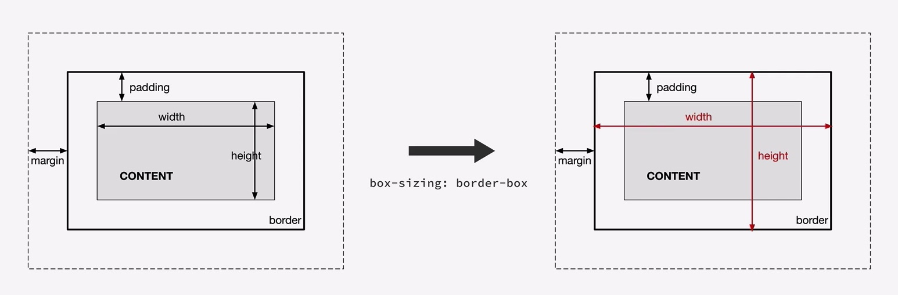

## Tech Stack
---
- React.js
- Javascript
- Sass
- HTML/CSS
- Animations
- ESlint
- Prettier
- Google fonts
- Font Awesome
## clip-path polygon css

```
img {
  clip-path: polygon(50% 0%, 100% 50%, 50% 100%, 0% 50%);
}

```


## How units are converted from relative to absolute(px)

> Resources : Jonas Schmedtmann Udemy courses
## The box model


## The box model with box sizing


### Additional Resources
1. <a href="https://bennettfeely.com/clippy/" target="_blank">CSS clip-path maker</a>