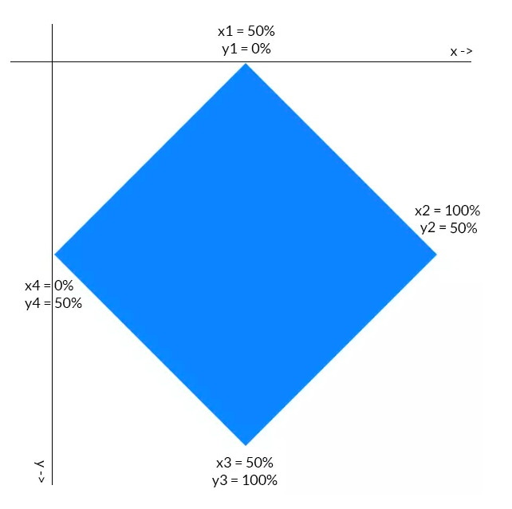

## Tech Stack
---
- React.js
- Javascript
- HTML/CSS
- ESlint
- Prettier
- Google fonts
- Font Awesome
## clip-path polygon css

```
img {
  clip-path: polygon(50% 0%, 100% 50%, 50% 100%, 0% 50%);
}

```



### Additional Resources
1. <a href="https://bennettfeely.com/clippy/" target="_blank">CSS clip-path maker</a>